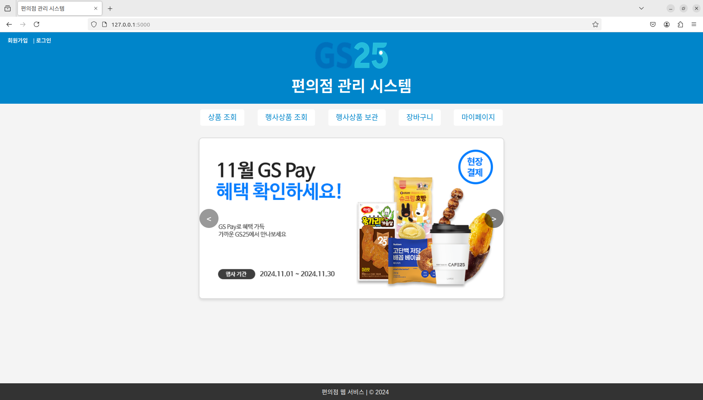

# Database: 2024-2 데이터베이스(나)반 팀 프로젝트
## 프로젝트 요약
### 기여자
- dlsy(WEB FE): 2024-09-02 ~ 2024-12-13
- Groo(WEB BE): 2024-09-02 ~ 2024-12-13
- shagyeong(DB): 2024-09-02 ~
### 웹
- HTML5
- CSS
- JavaScript
- Python Flask
### 데이터베이스
- MySQL
### 테스트 환경
- Ubuntu 22.04
### 테스트
- app.py
    ```python
    db_config = {
        'host': 'localhost',    # 데이터베이스 호스트
        'user': 'username',     # MySQL 사용자명 입력
        'password': '1234',     # MySQL 비밀번호 입력
        'database': 'Coldcache' # 데이터베이스 이름
    }
    ```
- 데이터베이스 임포트
    ```
    $ mysql -u username -p
    Enter password:
    mysql> souruce ./Clodcache.sql;
    mysql> show databases;
    +--------------------+
    | Database           |
    +--------------------+
    | Coldcache          |
    +--------------------+
    1 rows in set (0.00 sec)
    mysql> show tables;
    +---------------------+
    | Tables_in_Coldcache |
    +---------------------+
    | cart                |
    | category            |
    | customer            |
    | event_product       |
    | payment             |
    | product             |
    | save_event_product  |
    +---------------------+
    7 rows in set (0.00 sec)
    mysql> quit
    Bye
    $ 
    ```
- 웹 구동
    ```
    $ python3 app.py
     * Serving Flask app 'app'
     * Debug mode: on
    WARNING: This is a development server. Do not use it in a production deployment. Use a production WSGI server instead.
     * Running on http://127.0.0.1:5000
    Press CTRL+C to quit
    ```
- http://127.0.0.1:5000
    

## 프로젝트 확장
### FE
- *jQuery*
### BE
- *세션*
- *환경변수 파싱*
### DB
- *BLOB*