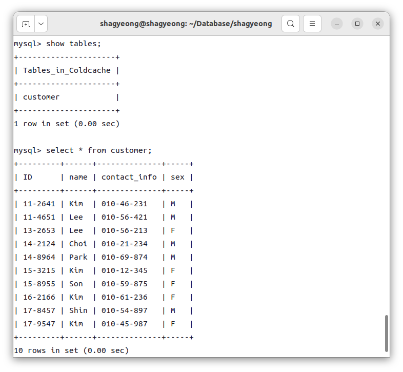

#### 정규화 : category
* product 릴레이션의 'category' attribute
* 갱신/삭제 이상
* University.sql의 department에 대응
    * student가 dept_name을 외래키로 참조
    * product가 category를 외래키로 참조

#### 관계 릴레이션
* reservation : customer, product간 관계 릴레이션이므로 'reserves'로 명명

#### 재고 관리(inventory)
* product_id와 expire_date로 재고를 고유하게 식별
* 상품의 유통기한별로 재고 관리 가능