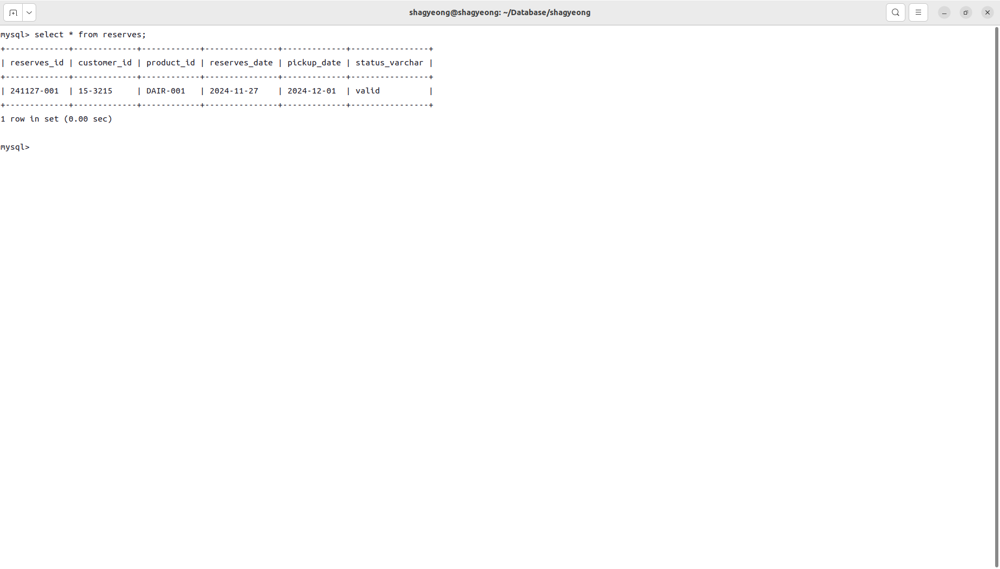

# 파일 개관
## 관계 스키마
### category
* <u>category_name varchar(20)</u> : 상품 유형 dairy, bakery, snack, ...
* category_code varcar(4) : 상품 코드(상품 ID 생성에 사용) DAIR, BAKE, SNAC, ...
* 정규화
    * category를 product 릴레이션의 속성으로 유지할 경우 : 갱신/삭제 이상
    * 테이블을 분리하여 3정규형으로 정규화
    * University.sql의 department에 대응하는 구조
### product
* <u>product_id varchar(10)</u> : 상품 ID
* category_name varchar(10) : 상품 유형(category)
* name varchar(10) : 상품명
* price DECIMAL(10) : 가격
### inventory(재고 관리)
* <u>product_id varchar(10)</u> : 상품 ID
* <u>expire_date varchar(10)</u> : 유통기한 0000-00-00 형태
* stock_quantity decimal(10) : 재고
* 상품ID와 유통기한으로 튜플을 고유하게 식별해 재고 관리하도록 함
### customer
* <u>customer_idvarchar(10)</u> : 고객 ID
* name varchar(20) : 이름
* contact_info varchar(10) : 연락처
* sex varchar(1) : 성별
### reserves(장바구니)
* <u>reserves_id varchar(10)</u> : 예약 ID 241127-001 형태
* customer_id varchar(10) : 고객 ID
* product_id varchar(10) : 상품 ID
* reserves_date varchar(10) : 예약 날짜 0000-00-00 형태
* pickup_date varchar(10) : 픽업 날짜 0000-00-00 형태
* status_varchar varchar(10) : 상태
* customer, product간 관계 릴레이션이므로 'reservation'이 아닌 'reserves'로 명명

# demo
### show tables 
### category 
### product 
### inventory 
### customer 
### reserves 