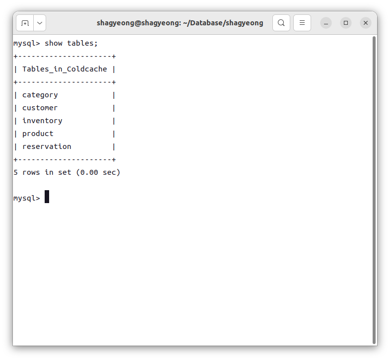
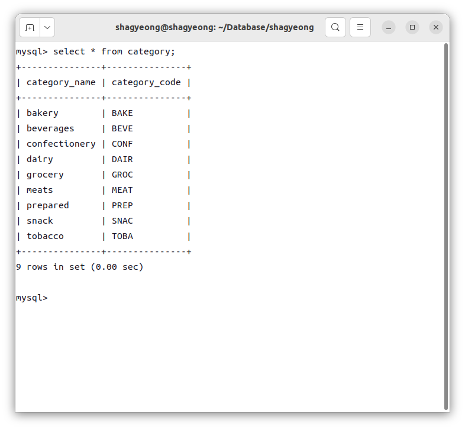
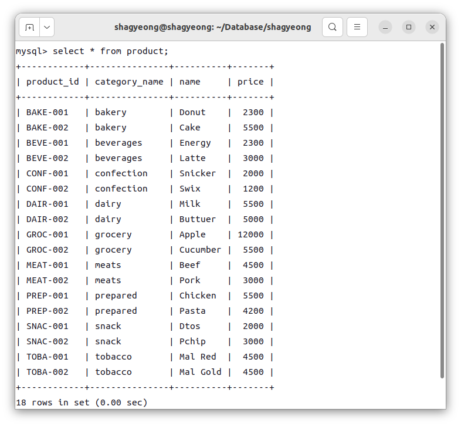
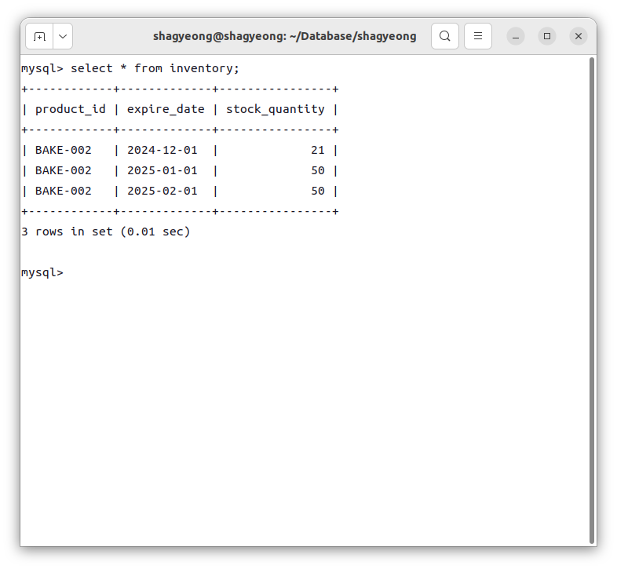
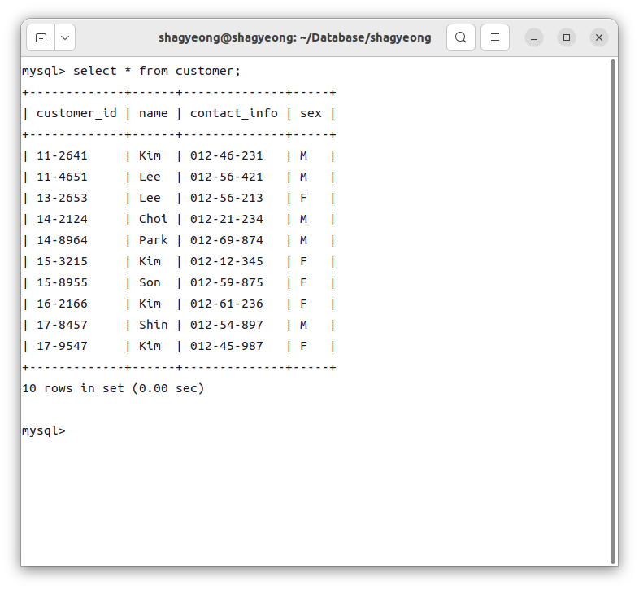
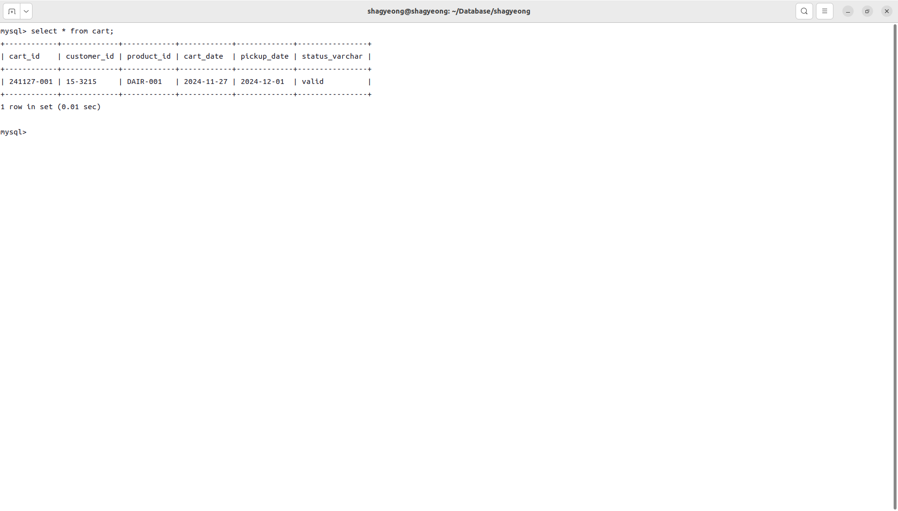
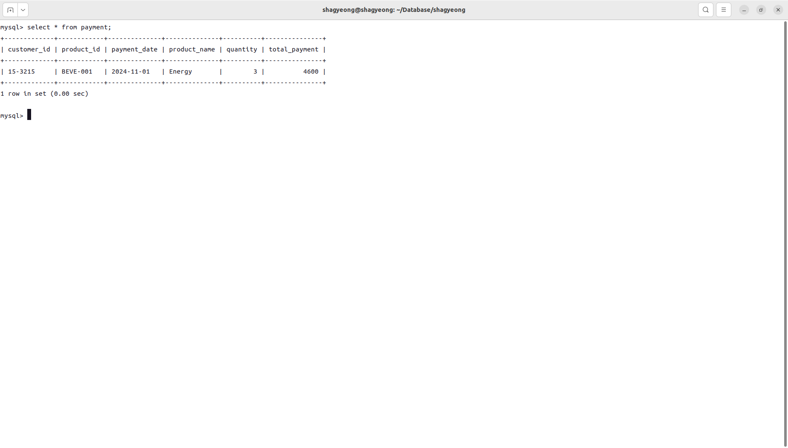
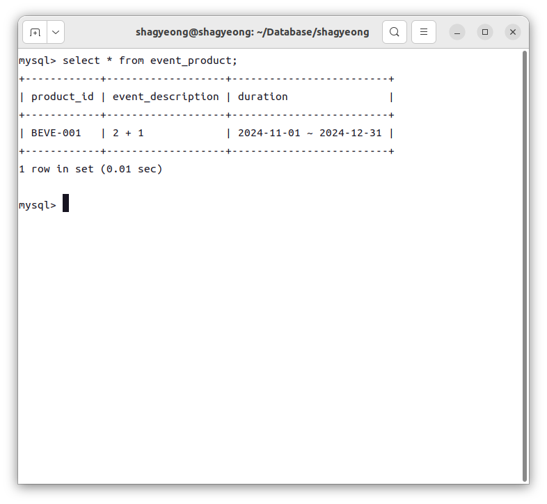
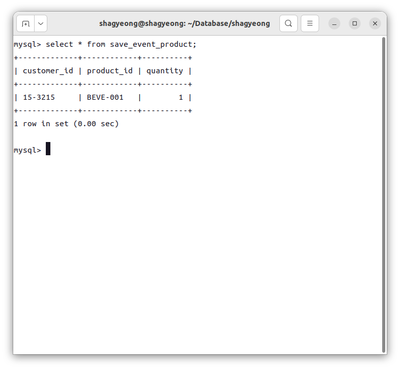

# 파일 개관
## 관계 스키마
### category
* 속성
    * <u>category_name varchar(20)</u> : 상품 유형 dairy, bakery, snack, ...
    * category_code varcar(4) : 상품 코드(상품 ID 생성에 사용) DAIR, BAKE, SNAC, ...
* 정규화
    * category를 product 릴레이션의 속성으로 유지할 경우 : 갱신/삭제 이상
    * 테이블을 분리하여 3정규형으로 정규화
    * University.sql의 department에 대응하는 구조
### product
* 속성
    * <u>product_id varchar(10)</u> : 상품 ID
    * category_name varchar(10) : 상품 유형(category)
    * name varchar(10) : 상품명
    * price DECIMAL(10) : 가격
### customer
* 속성
    * <u>customer_id varchar(10)</u> : 고객 ID
    * name varchar(20) : 이름
    * contact_info varchar(10) : 연락처
    * sex varchar(1) : 성별
#### reservation->reserves->cart(장바구니)
* 속성
    * <u>reserves_id varchar(10)</u> : 예약 ID 241127-001 형태
    * customer_id varchar(10) : 고객 ID
    * product_id varchar(10) : 상품 ID
    * reserves_date varchar(10) : 예약 날짜 0000-00-00 형태
    * pickup_date varchar(10) : 픽업 날짜 0000-00-00 형태
    * status_varchar varchar(10) : 상태
* customer, product간 관계 릴레이션이므로 'reservation'이 아닌 'reserves'로 명명 -> 직관적인 이름인 'cart'로 명명
#### payment(결제내역)
* 속성
    * <u>customer_id varchar(10)</u> : 고객 ID
    * <u>product_id varchar(10)</u> : 상품 ID
    * <u>payment_date</u> : 결제 날짜
    * product_name : 상품명
    * quantity : 수량
    * total_payment : 총 결제액
* 고객, 상품, 결제 날짜로 결제 내역을 고유하게 식별
* 행사 여부에 관계없이 장바구니에서 구매시 상품 튜플이 삽입됨
* 본인의 결제 내역 조회시 customer_id로 select
#### event_product(행사 상품)
* 속성
    * <u>product_id</u>
    * event_description : 행사 내용(1+1, 2+1, 10% 할인 등등)
    * duration varchar(23) : 행사 기간 0000-00-00 ~ 0000-00-00 형태
* 'description'이 MySQL 예약어로 존재하여 속성명 변경 'description' -> 'event_description'
#### save_event_product(증정품 보관함)
* 속성
    * <u>customer_id</u>
    * <u>product_id</u>
    * quantity : 수량
#### *마이페이지*
<!-- 로그인 구현시 사용자 정보 띄움 -->
#### *inventory(재고 관리)*
<!--* <u>product_id varchar(10)</u> : 상품 ID
* <u>expire_date varchar(10)</u> : 유통기한 0000-00-00 형태
* stock_quantity decimal(10) : 재고
* 상품ID와 유통기한으로 튜플을 고유하게 식별해 재고 관리하도록 함 -->

# demo
### show tables 
### category 
### product 
<!-- ### inventory  -->
### customer 
### cart 
### payment 
### event_product 
### save_event_product 